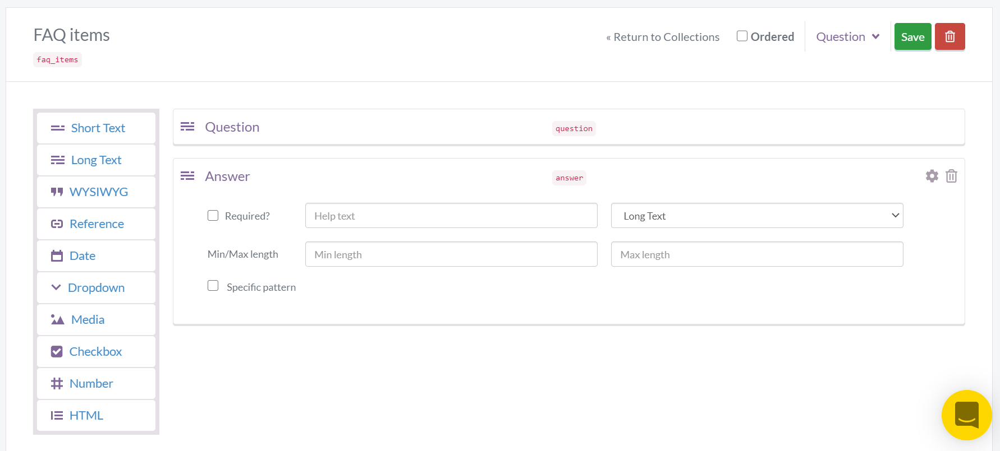
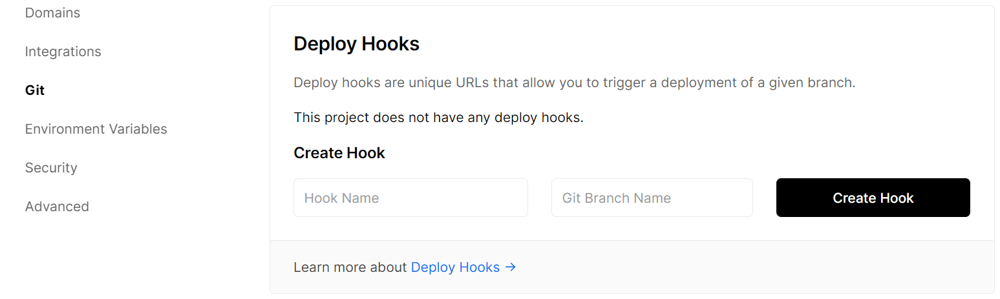

# React CMS-powered application built with Next.js

[](https://vercel.com/new/git/external?repository-url=https%3A%2F%2Fgithub.com%2Fbuttercms%2Freact-cms-blog-with-next-js)

- Demo: https://react-cms-blog-with-next-js.orlyohreally.vercel.app/

[Next.js](https://github.com/vercel/next.js/) is a small framework for building universal React webapps. Next.js comes with Webpack and Babel built-in. You can read more about the philosophy behind Next.js [here](https://zeit.co/blog/next).

[ButterCMS](https://buttercms.com) is a hosted API-based CMS and blog engine that lets you build CMS-powered apps using any programming language. You can think of Butter as similar to WordPress except that you build your website in your language of choice and then plug-in the dynamic content using an API.

This projects shows how to integrate ButterCMS into Next.js application:

- How to create page with a list of blog posts and pages for each post. Learn more about blog integration [here](https://buttercms.com/docs/api/#get-your-blog-posts).
- How to dynamically create pages using data from ButterCMS pages. Learn more about fetching single pages and pages with types [here](https://buttercms.com/docs/api/#pages).
- How to display collections items on the page. Learn more on how to query collections [here](https://buttercms.com/docs/api/#retrieve-a-collection).
- How to get all posts categories. Learn more about categories [here](https://buttercms.com/docs/api/#categories).
- How to create pages with RSS, Atom, and Sitemap feeds. Learn more [here](https://buttercms.com/docs/api/#feeds).

Link to ButterCMS API documentation is https://buttercms.com/docs/api/.

## Set up ButterCMS account

1. Create a free account on ButterCMS - https://buttercms.com/.
2. To see the project locally you need to create this data in your account:
   - Create and publish customer case study pages (page with type `customer_case_study`) with this structure:
     
     Learn more about page types [here](https://buttercms.com/docs/api-client/nextjs#PagesPageType).
   - Create collection `faq_items` with this structure:
     
     Learn more about collections [here](https://buttercms.com/docs/api-client/nextjs#Collections).
3. Find your read API token from the home page or from settings page, it will be needed later.

## Requirements

- Node >= 12.0.0

## Running project locally

1. Clone and cd into project:

```
git clone https://github.com/ButterCMS/react-cms-blog-with-next-js.git
cd react-cms-blog-with-next-js.git
```

2. Install all dependencies

```
npm install
```

or

```
yarn install
```

1. Copy `.env.example` file as `.env` and replace `BUTTER_CMS_API_KEY` value with your read API token
2. Run the app in development mode

```
npm run dev
```

or

```
yarn dev
```

The application should be available at `http://localhost:3000`.

To build the project run `npm run build` and to start run `npm start`

## Deploy on Vercel

1. Create a Vercel account at https://vercel.com/signup and download [the CLI](https://vercel.com/download)
2. Run `vercel` at the project root

## Webhooks to trigger deployment

We can make use of the ButterCMS webhooks to notify the application every time a post, page or collection item are added or modified, and reload the Next.js application.

You can add a new webhook by going to the [https://buttercms.com/webhooks/](https://buttercms.com/webhooks/) page.


If you use Vercel, you can create deploy webhooks there. 

## Wrap up

Next.js is a powerful framework that makes it easy to build universal React apps. With ButterCMS you can quickly build CMS-powered applications and websites with React and Node.js.

We hope you enjoyed this tutorial. If you have any questions about setting up your ButterCMS-powered application feel free to contact ButterCMS support.

## Other

View ReactJS [Blog engine](https://buttercms.com/react-blog-engine/) and [Full CMS](https://buttercms.com/react-cms/) for other examples of using ButterCMS with ReactJS. And check out [Next.js Blog engine](https://buttercms.com/nextjs-blog-engine/) and [Next.js CMS](https://buttercms.com/nextjs-cms/) for other Next.js examples.
