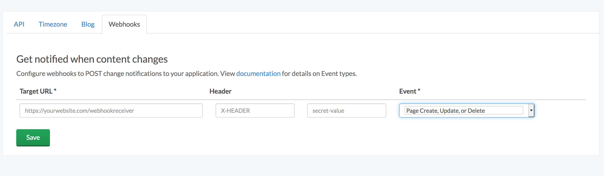

# React CMS-powered blog built with Next.js

[Next.js](https://github.com/zeit/next.js/) is a small framework for building universal React webapps. Next.js comes with Webpack and Babel built-in. You can read more about the philosophy behind Next.js [here](https://zeit.co/blog/next).

[ButterCMS](https://buttercms.com) is a hosted API-based CMS and blog engine that lets you build CMS-powered apps using any programming language. You can think of Butter as similar to WordPress except that you build your website in your language of choice and then plug-in the dynamic content using an API.

## Getting Started

Create a new directory for your app and add a package.json file:

```json
{
  "name": "react-blog"
}
```

Next, install Next.js, React, and the ButterCMS API. As of the time of this writing, we'll want to install the Next.js for custom routing we'll use later:

```
npm install next@beta react react-dom buttercms  --save
```

Then add a script to your package.json:

```json
{
  "scripts": {
    "start": "next"
  }
}
```

Next.js treats every js file in the `./pages` directory as a page. Let's setup a basic homepage by creating a `./pages/index.js` inside your project:

```js
export default () => (
  <div>My blog homepage</div>
)
```

And then just run `npm run start` and go to `http://localhost:3000`.

Then create a `./pages/post.js` and check it out at `http://localhost:3000/post`:

```js
export default () => (
  <div>A blog post</div>
)
```

## Pages

### Integrate into your application

With our page defined, the ButterCMS API will return it in JSON format like this:

```json
{
    "data": {
        "slug": "acme-co",
        "fields": {
            "facebook_open_graph_title": "Acme Co loves ButterCMS",
            "seo_title": "Acme Co Customer Case Study",
            "headline": "Acme Co saved 200% on Anvil costs with ButterCMS",
            "testimonial": "<p>We've been able to make anvils faster than ever before! - <em>Chief Anvil Maker</em></p>\r\n<p></p>",
            "customer_logo": "https://cdn.buttercms.com/c8oSTGcwQDC5I58km5WV",
        }
    }
}
```

Create a `pages/case-study.js` file:

```jsx
import React from 'react'
import Butter from 'buttercms'
import Head from 'next/head'

const butter = Butter('your_api_token')

export default class extends React.Component {
  static async getInitialProps ({ query }) {
    const resp = await butter.page.retrieve('customer_case_study', query.slug)
    return resp.data
  }
  render () {
    const product = this.props.data
    const { seo_title: seoTitle, customer_logo: customerLogo, headline, testimonial } = product.fields

    return (
      <div>
        <Head>
          <title>{seoTitle}</title>
        </Head>

        <div>
          
        </div>
        <h1>{headline}</h1>
        <div dangerouslySetInnerHTML={{ __html: testimonial }} />
      </div>
    )
  }
}

```

### Update the routes in your app to route to the specified components

Finally, we add the route for the page to `server.js`:

```js
server.get('/case-studies/:slug', (req, res) => {
  return app.render(req, res, '/case-study', { slug: req.params.slug })
})
```

### Setup the Customers Page to list all our customers.

Create a new file `pages/case-studies.js`. In this file, we should:

1. Initialize the butterCMS library
2. On the `getInitialProps` hook, fetch the list of case studies
3. Return the response data as the component props

```jsx
import React from 'react'
import Butter from 'buttercms'

const butter = Butter('your_api_token')

export default class extends React.Component {
  static async getInitialProps ({ query }) {
    const resp = await butter.page.list('customer_case_study')
    return resp.data
  }
  render () {
    return (
      <div>
        {this.props.data.map((caseStudy, key) => {
          return (
            <div key={key}>
              
              <a href={`/case-studies/${caseStudy.slug}`}>{caseStudy.fields.headline}</a>
            </div>
          )
        })}
      </div>
    )
  }
}
```

There is no need to make a route for the `product.js` page, since Next.js automatically creates a page using it's convention. We can view all the products by going to the `/products` route once we start the server.

## Content fields

### Integrate with your app

Create a new file `pages/faq.js`. In this component, we will have to fetch the FAQ content in the `getInitialProps` hook:

```jsx
import React, { Component } from 'react'
import Butter from 'buttercms'

const butter = Butter('your_api_token')

class Faq extends Component {
  static async getInitialProps () {
    const resp = await butter.content.retrieve([ 'faq_headline', 'faq_items' ])
    return resp.data.data
  }

  render () {
    return (
      <div>
        <h1>{this.props.faq_headline}</h1>

        <ul>
          {this.props.faq_items.map((item) => {
            return (
              <li>
                <h4>{item.question}</h4>
                <p>{item.answer}</p>
              </li>
            )
          })}
        </ul>
      </div>
    )
  }
}

export default Faq
```

Once this is done, reload the app, and the component will automatically display on the `/faq` route. 

## Blog Engine

### Setup the Blog page to list all our posts.

We'll load the ButterCMS package in index.js and setup a React component that fetches and displays posts:

```js
import React from 'react'
import Link from 'next/link'
import Butter from 'buttercms'

const butter = Butter('<your_api_key>')

export default class extends React.Component {
  static async getInitialProps({ query }) {
    let page = query.page || 1;

    const resp = await butter.post.list({page: page, page_size: 10})    
    return resp.data;
  }
  render() {
    const { next_page, previous_page } = this.props.meta;

    return (
      <div>
        {this.props.data.map((post) => {
          return (
            <div><a href={`/post/${post.slug}`}>{post.title}</a></div>
          )
        })}

        <br />

        <div>
          {previous_page && <Link href={`/?page=${previous_page}`}><a>Prev</a></Link>}
        
          {next_page && <Link href={`/?page=${next_page}`}><a>Next</a></Link>}
        </div>
      </div>
    )
  }
}
```

With Next.js `getInitialProps` will execute on the server on initial page loads, and then on the client when navigating to a different routes using the built-in `<Link>` component. `getInitialProps` also receives a context object with various properties – we access the `query` property for handling pagination. We are fetching posts from a ButterCMS test account – sign in with Github to setup your own posts. 

In our `render()` method we use some clever syntax to only display pagination links only when they're applicable. Our post links will take us to a 404 – we'll get these working next.

### Setup the Blog Post page to list a single post

We'll also update our post component to fetch blog posts via slug and render the title and body:

```js
import React from 'react'
import Butter from 'buttercms'

const butter = Butter('<your_api_key>')

export default class extends React.Component {
  static async getInitialProps({ query }) {
    const resp = await butter.post.retrieve(query.slug);  
    return resp.data;
  }
  render() {
    const post = this.props.data;

    return (
      <div>
        <h1>{post.title}</h1>
        <div dangerouslySetInnerHTML={{__html: post.body}} />
      </div>
    )
  }
}
```

### Add routes to the server

To get our post links working we need to setup dynamic routing for our blog posts. First, create a custom server `./server.js` that routes all `/posts/:slug` URLs to our post component, and the `/posts` URL to our index page:

```js
const next = require('next')
const express = require('express')
const dev = process.env.NODE_ENV !== 'production'
const app = next({ dev })
const handle = app.getRequestHandler()
const port = 3000

app.prepare().then(() => {
  const server = express()

  server.get('/posts', (req, res) => {
    return app.render(req, res, '/index', { slug: req.params.slug })
  })

  server.get('/posts/:slug', (req, res) => {
    return app.render(req, res, '/post', { slug: req.params.slug })
  })

  server.get('*', (req, res) => {
    return handle(req, res)
  })

  server.listen(port, (err) => {
    if (err) throw err
    console.log(`> Ready on http://localhost:${port}`)
  })
})
```

Finally, update our `package.json` start script to use our customer server and restart:

```json
"scripts": {
  "start": "node server.js"
}
```

### Post categories

We can use the ButterCMS API to get all post categories and all posts under a category. Let's create routes in the `server.js` file for the page categories, and the index of pages under a single category:

```js
//...

// Page categories
server.get('/posts/categories', (req, res) => {
  return app.render(req, res, '/categories')
})

// All pages under a single catrogory
server.get('/posts/category/:slug', (req, res) => {
  return app.render(req, res, '/category', { slug: req.params.slug })
})

//...
```

We can then create the React component for the pages. Create a new file `pages/categories.js` :

```js
import React from 'react'
import Butter from 'buttercms'

const butter = Butter('<your_api_key>')

export default class extends React.Component {
  static async getInitialProps ({ query }) {
    const resp = await butter.category.list()
    console.log(resp.data)
    return resp.data
  }
  render () {
    return (
      <div>
        {this.props.data.map((category, key) => {
          return (
            <div key={key}>
              <a href={`/posts/category/${category.slug}`}>{category.name}</a>
            </div>
          )
        })}
      </div>
    )
  }
}
```

This will create a page that will list all categories, along with linking each of them to their own page. Now, create a `pages/category.js` file, that will contain the component to list all pages under a single category:

```js
import React from 'react'
import Butter from 'buttercms'
import Head from 'next/head'

const butter = Butter('<your_api_key>')

export default class extends React.Component {
  static async getInitialProps ({ query }) {
    const resp = await butter.category.retrieve(query.slug, {
      include: 'recent_posts'
    })
    return resp.data
  }
  render () {
    const category = this.props.data

    return (
      <div>
        <Head>
          <title>{category.name}</title>
        </Head>
        <h1>{category.name}</h1>
        <div>
          {this.props.data.recent_posts.map((post, key) => {
            return (
              <div key={key}>
                <a href={`/posts/${post.slug}`}>{post.title}</a>
              </div>
            )
          })}
        </div>
      </div>
    )
  }
}
```

The links on these pages will be to the individual posts themselves.

## RSS, Atom, and Sitemap

We can fetch the RSS, Atom, and Sitemap feeds using the ButterCMS API, and pipe the response to routes on our server. Create the `/sitemap`, `/rss`, and `/atom` routes inside `server.js`

```js
server.get('/sitemap', (req, res) => {
  butter.feed.retrieve('sitemap').then((s) => {
    res.send(s.data.data)
  })
})

server.get('/atom', (req, res) => {
  butter.feed.retrieve('atom').then((s) => {
    res.send(s.data.data)
  })
})

server.get('/rss', (req, res) => {
  butter.feed.retrieve('rss').then((s) => {
    res.send(s.data.data)
  })
})
```

These routes will also update dynamically, everytime new content is added, or updated.


### SEO

Next.js provides a `<Head>` component for setting HTML titles and meta tags. Add `import Head from 'next/head'` to the top of `./pages/post.js` and use the component in the `render()` method:

```js
render() {
  const post = this.props.data;

  return (
    <div>
      <Head>
        <title>{post.seo_title}</title>
        <meta name="description" content={post.meta_description} />
        <meta name="og:image" content={post.featured_image} />
      </Head>

      <h1>{post.title}</h1>
      <div dangerouslySetInnerHTML={{__html: post.body}} />
    </div>
  )
}
```

Restart the server and inspect the HTML source of a post to verify that tags are getting set correctly.

## Reloading the Next.js app on adding a new page

We can make use of the ButterCMS webhooks to notify our application everytime a new page is added or modified, and reload the next.js application.

You can add a new webhook by going to the [https://buttercms.com/webhooks/](https://buttercms.com/webhooks/) page. There, you can provide the URL of your deployed application:



Suppose your server is deployed with the address `http://abc.def/`, we can create a `/webhook-receiver` route, so that the resulting webhook URL configured on ButterCMS would be `http://abc.def/webhook-receiver`. We will get a POST request everytime there is a change, so lets create the corresponding route inside `server.js`

```js
server.post('/webhook-receiver', (req, res) => {
  console.log('a post has been modified')
  app
    .prepare()
    .then(() => {
      console.log('app refreshed')
      res.end()
    })
    .catch((e) => {
      res.status(500).end()
    })
})
```

The route will call the `app.prepare` function, which reloads the Next.js application.

## Wrap up

Next.js is a powerful framework that makes it easy to build universal React apps. With ButterCMS you can quickly build CMS-powered blogs and websites with React and Node.js.

We hope you enjoyed this tutorial. If you have any questions about setting up your ButterCMS-powered Next.js/React app reach out to me at roger@buttercms.com or on Twitter.

## Other

View ReactJS [Blog engine](https://buttercms.com/react-blog-engine/) and [Full CMS](https://buttercms.com/react-cms/) for other examples of using ButterCMS with ReactJS. And check out [Next.js Blog engine](https://buttercms.com/nextjs-blog-engine/) and [Next.js CMS](https://buttercms.com/nextjs-cms/) for other Next.js examples.

